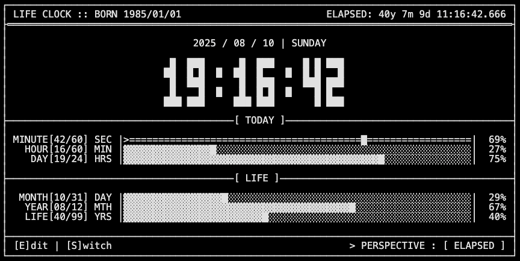

# Life Clock

A terminal-style life progress monitor, built with Next.js and TypeScript.



## Background

This project is a digital life clock that visualizes your life's progress in a retro, terminal-like interface. It calculates and displays the elapsed and remaining time based on your birth date and life expectancy, offering a unique perspective on time.

## How to Start

1.  **Install Dependencies:**
    ```bash
    pnpm install
    ```

2.  **Run the Development Server:**
    ```bash
    pnpm dev
    ```

Open [http://localhost:3000](http://localhost:3000) in your browser to see the result.

## Key Features & Interaction

*   **Real-Time Progress:** Displays your life progress down to the millisecond.
*   **Dual Perspectives:**
    *   Press `S` or `Space` or click the `[SWITCH]` button to switch between "ELAPSED" and "REMAINING" time.
*   **Customizable Settings:**
    *   Press `E` or click the `[EDIT]` button to open the setup overlay.
    *   Edit your birth date and life expectancy by typing or clicking on the fields.
    *   Press `Enter` or click the `[CONFIRM]` button to save.
    *   Press `Escape` or click the `[CANCEL]` button to cancel.
*   **Theme Switching:**
    *   Press `T` to cycle through different color themes.

## Technical Stack

*   **Framework:** Next.js (App Router)
*   **Language:** TypeScript
*   **Styling:** Tailwind CSS
*   **Date/Time:** date-fns
*   **State Management:** React Hooks & Context API
*   **Linting/Formatting:** ESLint + Prettier
